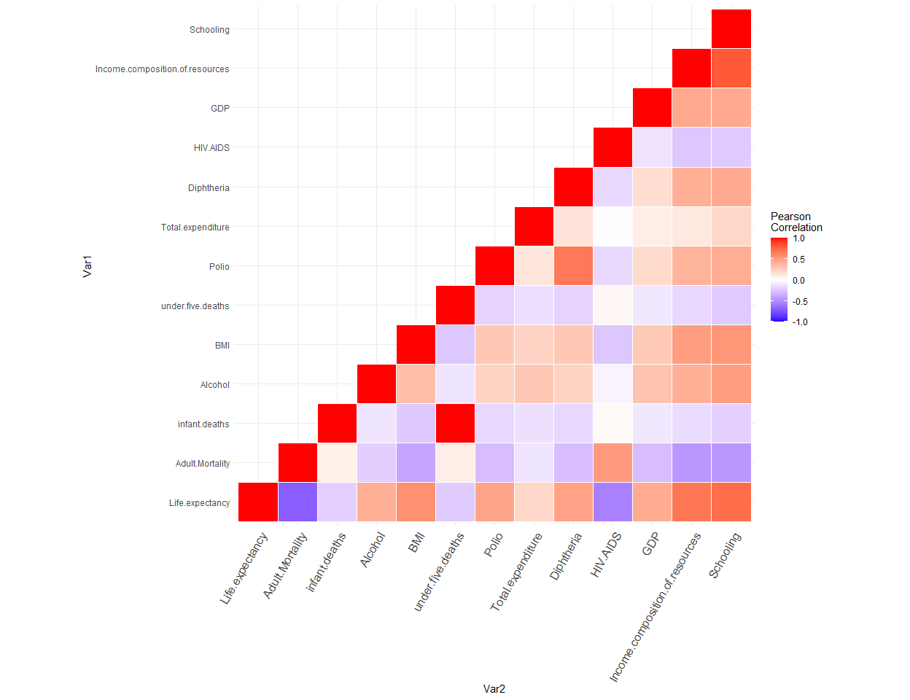

Data exploration
================
Peiyuan Li
December 8, 2020

**Let us read the saved dataset from the previous section using read.csv
command**

``` r
WHO_df <- read.csv("WHO_data_filled.csv",header=TRUE)
```

## **Univariate analysis**

**Univariate analysis with boxplot**

``` r
par(mfrow=c(3,6))
for (i in 4:length(WHO_df)) {
        boxplot(WHO_df[,i], main=names(WHO_df[i]))
}
```

<!-- --> By
looking at the boxplot, we may find a large number of outliers. However,
I suspect that those values are correct, because I recognize that we do
not live in a perfect world. The wealth distribution across the world
varies a lot. Not to mention that countless people are still struggling
with wars and diseases.  

**Univariate analysis with histogram**

``` r
par(mfrow=c(3,6))
for (i in 4:length(WHO_df)) {
        hist(WHO_df[,i], main=names(WHO_df[i]), xlab = names(WHO_df[i]))
}
```

<!-- -->
Histogram provides an idea of the distribution of values for each
variable. It tells us that not all variable’s values are normally
distributed.  

**Let us try to fit a linear model**

``` r
For_lm_DF <- WHO_df[-c(1:2)]
```

Before we fit it with “lm” command, I must drop two more variables:
Country and Year. For variable Country, it would be unrealistic to fit
it into a linear model, because it has 193 different countries, which is
impossible to fit it into a linear model. For variable Year, it tells us
when the variable was collected. However, it does not provide any
insight for a linear model. Because it is unreasonable to assume
individual’s life expectancy to change due to variable year only.  

``` r
fit <- lm(Life.expectancy ~ ., data = For_lm_DF)
summary(fit)
```

    ## 
    ## Call:
    ## lm(formula = Life.expectancy ~ ., data = For_lm_DF)
    ## 
    ## Residuals:
    ##      Min       1Q   Median       3Q      Max 
    ## -22.9702  -2.3415   0.0001   2.3831  15.8589 
    ## 
    ## Coefficients:
    ##                                   Estimate Std. Error t value Pr(>|t|)    
    ## (Intercept)                      5.693e+01  6.306e-01  90.281  < 2e-16 ***
    ## StatusDeveloping                -1.773e+00  2.726e-01  -6.505 9.10e-11 ***
    ## Adult.Mortality                 -1.927e-02  8.016e-04 -24.035  < 2e-16 ***
    ## infant.deaths                    1.055e-01  8.306e-03  12.702  < 2e-16 ***
    ## Alcohol                          1.094e-01  2.566e-02   4.262 2.09e-05 ***
    ## percentage.expenditure           3.126e-05  9.037e-05   0.346  0.72942    
    ## Hepatitis.B                     -2.828e-04  3.691e-03  -0.077  0.93894    
    ## Measles                         -1.371e-05  7.694e-06  -1.782  0.07493 .  
    ## BMI                              4.115e-02  4.973e-03   8.275  < 2e-16 ***
    ## under.five.deaths               -7.907e-02  6.141e-03 -12.876  < 2e-16 ***
    ## Polio                            2.561e-02  4.508e-03   5.682 1.47e-08 ***
    ## Total.expenditure                7.744e-02  3.292e-02   2.353  0.01871 *  
    ## Diphtheria                       2.919e-02  4.875e-03   5.989 2.37e-09 ***
    ## HIV.AIDS                        -4.858e-01  1.759e-02 -27.612  < 2e-16 ***
    ## GDP                              3.980e-05  1.370e-05   2.905  0.00369 ** 
    ## thinness..1.19.years            -2.565e-02  4.749e-02  -0.540  0.58910    
    ## thinness.5.9.years              -2.693e-02  4.757e-02  -0.566  0.57135    
    ## Income.composition.of.resources  5.064e+00  6.281e-01   8.063 1.07e-15 ***
    ## Schooling                        6.565e-01  4.267e-02  15.387  < 2e-16 ***
    ## ---
    ## Signif. codes:  0 '***' 0.001 '**' 0.01 '*' 0.05 '.' 0.1 ' ' 1
    ## 
    ## Residual standard error: 4.071 on 2919 degrees of freedom
    ## Multiple R-squared:  0.8185, Adjusted R-squared:  0.8174 
    ## F-statistic: 731.3 on 18 and 2919 DF,  p-value: < 2.2e-16

By looking at the summary report, we find some of p-values corresponding
to the coefficients are large, it indicates that not all of them are
statistically significant. We may need to select or transform them.  

## **Variable selection methods**

**Stepwise regression**

``` r
library(olsrr)
ols_step_both_p(fit)
```

    ## Stepwise Selection Method   
    ## ---------------------------
    ## 
    ## Candidate Terms: 
    ## 
    ## 1. Status 
    ## 2. Adult.Mortality 
    ## 3. infant.deaths 
    ## 4. Alcohol 
    ## 5. percentage.expenditure 
    ## 6. Hepatitis.B 
    ## 7. Measles 
    ## 8. BMI 
    ## 9. under.five.deaths 
    ## 10. Polio 
    ## 11. Total.expenditure 
    ## 12. Diphtheria 
    ## 13. HIV.AIDS 
    ## 14. GDP 
    ## 15. thinness..1.19.years 
    ## 16. thinness.5.9.years 
    ## 17. Income.composition.of.resources 
    ## 18. Schooling 
    ## 
    ## We are selecting variables based on p value...
    ## 
    ## Variables Entered/Removed: 
    ## 
    ## - Schooling added 
    ## - HIV.AIDS added 
    ## - Diphtheria added 
    ## - Status added 
    ## - BMI added 
    ## - Polio added 
    ## - GDP added 
    ## - under.five.deaths added 
    ## - infant.deaths added 
    ## - Alcohol added 
    ## - Total.expenditure added 
    ## - thinness..1.19.years added 
    ## - Measles added 
    ## 
    ## No more variables to be added/removed.
    ## 
    ## 
    ## Final Model Output 
    ## ------------------
    ## 
    ##                         Model Summary                          
    ## --------------------------------------------------------------
    ## R                       0.905       RMSE                4.070 
    ## R-Squared               0.818       Coef. Var           5.882 
    ## Adj. R-Squared          0.818       MSE                16.562 
    ## Pred R-Squared          0.816       MAE                 3.033 
    ## --------------------------------------------------------------
    ##  RMSE: Root Mean Square Error 
    ##  MSE: Mean Square Error 
    ##  MAE: Mean Absolute Error 
    ## 
    ##                                   ANOVA                                   
    ## -------------------------------------------------------------------------
    ##                   Sum of                                                 
    ##                  Squares          DF    Mean Square       F         Sig. 
    ## -------------------------------------------------------------------------
    ## Regression    218180.765          15      14545.384    878.245    0.0000 
    ## Residual       48393.777        2922         16.562                      
    ## Total         266574.542        2937                                     
    ## -------------------------------------------------------------------------
    ## 
    ##                                              Parameter Estimates                                              
    ## -------------------------------------------------------------------------------------------------------------
    ##                           model      Beta    Std. Error    Std. Beta       t        Sig      lower     upper 
    ## -------------------------------------------------------------------------------------------------------------
    ##                     (Intercept)    56.915         0.627                  90.796    0.000    55.686    58.145 
    ##                 Adult.Mortality    -0.019         0.001       -0.251    -24.066    0.000    -0.021    -0.018 
    ## Income.composition.of.resources     5.056         0.627        0.113      8.063    0.000     3.826     6.286 
    ##                       Schooling     0.656         0.043        0.232     15.399    0.000     0.572     0.739 
    ##                        HIV.AIDS    -0.486         0.018       -0.259    -27.676    0.000    -0.521    -0.452 
    ##                      Diphtheria     0.029         0.004        0.073      6.556    0.000     0.020     0.038 
    ##                StatusDeveloping    -1.785         0.271       -0.071     -6.580    0.000    -2.317    -1.253 
    ##                             BMI     0.041         0.005        0.087      8.418    0.000     0.032     0.051 
    ##                           Polio     0.026         0.004        0.063      5.760    0.000     0.017     0.034 
    ##                             GDP     0.000         0.000        0.062      6.613    0.000     0.000     0.000 
    ##               under.five.deaths    -0.079         0.006       -1.330    -12.881    0.000    -0.091    -0.067 
    ##                   infant.deaths     0.105         0.008        1.304     12.710    0.000     0.089     0.122 
    ##                         Alcohol     0.110         0.026        0.047      4.319    0.000     0.060     0.160 
    ##               Total.expenditure     0.080         0.032        0.021      2.466    0.014     0.016     0.144 
    ##            thinness..1.19.years    -0.049         0.023       -0.024     -2.162    0.031    -0.094    -0.005 
    ##                         Measles     0.000         0.000       -0.016     -1.767    0.077     0.000     0.000 
    ## -------------------------------------------------------------------------------------------------------------

    ## 
    ##                                            Stepwise Selection Summary                                            
    ## ----------------------------------------------------------------------------------------------------------------
    ##                                             Added/                   Adj.                                           
    ## Step               Variable                Removed     R-Square    R-Square      C(p)          AIC         RMSE     
    ## ----------------------------------------------------------------------------------------------------------------
    ##    1            Adult.Mortality            addition       0.713       0.713    1680.0170    17921.0964    5.1035    
    ##    2    Income.composition.of.resources    addition       0.767       0.766     823.6440    17317.7583    4.6047    
    ##    3               Schooling               addition       0.782       0.782     581.5460    17122.0970    4.4531    
    ##    4               HIV.AIDS                addition       0.792       0.792     420.8290    16984.5390    4.3493    
    ##    5              Diphtheria               addition       0.800       0.800     288.4540    16866.0718    4.2618    
    ##    6                Status                 addition       0.803       0.803     244.9050    16826.0900    4.2322    
    ##    7                  BMI                  addition       0.805       0.805     213.8990    16797.2893    4.2108    
    ##    8                 Polio                 addition       0.807       0.806     191.5730    16776.3804    4.1951    
    ##    9                  GDP                  addition       0.816       0.815      46.8980    16636.3295    4.0956    
    ##   10           under.five.deaths           addition       0.818       0.817      22.5420    16612.0599    4.0780    
    ##   11             infant.deaths             addition       0.818       0.817      16.8210    16606.3199    4.0734    
    ##   12                Alcohol                addition       0.818       0.817      14.5640    16604.0435    4.0711    
    ##   13           Total.expenditure           addition       0.818       0.818      13.4460    16602.9074    4.0696    
    ## ----------------------------------------------------------------------------------------------------------------

Stepwise regression method selects 13 out of 18 variables. We may
interpret the selected variables later.  

**Backward elimination**

``` r
ols_step_backward_p(fit)
```

    ## Backward Elimination Method 
    ## ---------------------------
    ## 
    ## Candidate Terms: 
    ## 
    ## 1 . Status 
    ## 2 . Adult.Mortality 
    ## 3 . infant.deaths 
    ## 4 . Alcohol 
    ## 5 . percentage.expenditure 
    ## 6 . Hepatitis.B 
    ## 7 . Measles 
    ## 8 . BMI 
    ## 9 . under.five.deaths 
    ## 10 . Polio 
    ## 11 . Total.expenditure 
    ## 12 . Diphtheria 
    ## 13 . HIV.AIDS 
    ## 14 . GDP 
    ## 15 . thinness..1.19.years 
    ## 16 . thinness.5.9.years 
    ## 17 . Income.composition.of.resources 
    ## 18 . Schooling 
    ## 
    ## We are eliminating variables based on p value...
    ## 
    ## Variables Removed: 
    ## 
    ## - Hepatitis.B 
    ## - percentage.expenditure 
    ## - thinness..1.19.years 
    ## 
    ## No more variables satisfy the condition of p value = 0.3
    ## 
    ## 
    ## Final Model Output 
    ## ------------------
    ## 
    ##                         Model Summary                          
    ## --------------------------------------------------------------
    ## R                       0.905       RMSE                4.070 
    ## R-Squared               0.818       Coef. Var           5.882 
    ## Adj. R-Squared          0.818       MSE                16.562 
    ## Pred R-Squared          0.816       MAE                 3.032 
    ## --------------------------------------------------------------
    ##  RMSE: Root Mean Square Error 
    ##  MSE: Mean Square Error 
    ##  MAE: Mean Absolute Error 
    ## 
    ##                                   ANOVA                                   
    ## -------------------------------------------------------------------------
    ##                   Sum of                                                 
    ##                  Squares          DF    Mean Square       F         Sig. 
    ## -------------------------------------------------------------------------
    ## Regression    218181.099          15      14545.407    878.253    0.0000 
    ## Residual       48393.443        2922         16.562                      
    ## Total         266574.542        2937                                     
    ## -------------------------------------------------------------------------
    ## 
    ##                                              Parameter Estimates                                              
    ## -------------------------------------------------------------------------------------------------------------
    ##                           model      Beta    Std. Error    Std. Beta       t        Sig      lower     upper 
    ## -------------------------------------------------------------------------------------------------------------
    ##                     (Intercept)    56.891         0.623                  91.361    0.000    55.670    58.112 
    ##                StatusDeveloping    -1.779         0.271       -0.071     -6.557    0.000    -2.311    -1.247 
    ##                 Adult.Mortality    -0.019         0.001       -0.251    -24.043    0.000    -0.021    -0.018 
    ##                   infant.deaths     0.106         0.008        1.308     12.733    0.000     0.089     0.122 
    ##                         Alcohol     0.111         0.025        0.047      4.351    0.000     0.061     0.161 
    ##                         Measles     0.000         0.000       -0.017     -1.783    0.075     0.000     0.000 
    ##                             BMI     0.041         0.005        0.087      8.294    0.000     0.031     0.051 
    ##               under.five.deaths    -0.079         0.006       -1.334    -12.908    0.000    -0.091    -0.067 
    ##                           Polio     0.025         0.004        0.063      5.745    0.000     0.017     0.034 
    ##               Total.expenditure     0.079         0.033        0.021      2.442    0.015     0.016     0.143 
    ##                      Diphtheria     0.029         0.004        0.073      6.576    0.000     0.020     0.038 
    ##                        HIV.AIDS    -0.486         0.018       -0.259    -27.652    0.000    -0.520    -0.451 
    ##                             GDP     0.000         0.000        0.062      6.579    0.000     0.000     0.000 
    ##              thinness.5.9.years    -0.050         0.023       -0.024     -2.166    0.030    -0.094    -0.005 
    ## Income.composition.of.resources     5.063         0.627        0.113      8.076    0.000     3.834     6.293 
    ##                       Schooling     0.658         0.043        0.232     15.469    0.000     0.574     0.741 
    ## -------------------------------------------------------------------------------------------------------------

    ## 
    ## 
    ##                                    Elimination Summary                                    
    ## -----------------------------------------------------------------------------------------
    ##         Variable                                Adj.                                         
    ## Step           Removed            R-Square    R-Square     C(p)         AIC         RMSE     
    ## -----------------------------------------------------------------------------------------
    ##    1    Hepatitis.B                 0.8185      0.8174    17.0059    16606.4643    4.0707    
    ##    2    percentage.expenditure      0.8185      0.8175    15.1285    16604.5878    4.0701    
    ##    3    thinness..1.19.years        0.8185      0.8175    13.4260    16602.8872    4.0696    
    ## -----------------------------------------------------------------------------------------

Backward elimination method leaves 15 out of 18 variables. We may
interpret the selected variables later.  

**Forward selection**

``` r
ols_step_forward_p(fit)
```

    ## Forward Selection Method    
    ## ---------------------------
    ## 
    ## Candidate Terms: 
    ## 
    ## 1. Status 
    ## 2. Adult.Mortality 
    ## 3. infant.deaths 
    ## 4. Alcohol 
    ## 5. percentage.expenditure 
    ## 6. Hepatitis.B 
    ## 7. Measles 
    ## 8. BMI 
    ## 9. under.five.deaths 
    ## 10. Polio 
    ## 11. Total.expenditure 
    ## 12. Diphtheria 
    ## 13. HIV.AIDS 
    ## 14. GDP 
    ## 15. thinness..1.19.years 
    ## 16. thinness.5.9.years 
    ## 17. Income.composition.of.resources 
    ## 18. Schooling 
    ## 
    ## We are selecting variables based on p value...
    ## 
    ## Variables Entered: 
    ## 
    ## - Schooling 
    ## - HIV.AIDS 
    ## - Diphtheria 
    ## - Status 
    ## - BMI 
    ## - Polio 
    ## - GDP 
    ## - under.five.deaths 
    ## - infant.deaths 
    ## - Alcohol 
    ## - Total.expenditure 
    ## - thinness..1.19.years 
    ## - Measles 
    ## 
    ## No more variables to be added.
    ## 
    ## Final Model Output 
    ## ------------------
    ## 
    ##                         Model Summary                          
    ## --------------------------------------------------------------
    ## R                       0.905       RMSE                4.070 
    ## R-Squared               0.818       Coef. Var           5.882 
    ## Adj. R-Squared          0.818       MSE                16.562 
    ## Pred R-Squared          0.816       MAE                 3.033 
    ## --------------------------------------------------------------
    ##  RMSE: Root Mean Square Error 
    ##  MSE: Mean Square Error 
    ##  MAE: Mean Absolute Error 
    ## 
    ##                                   ANOVA                                   
    ## -------------------------------------------------------------------------
    ##                   Sum of                                                 
    ##                  Squares          DF    Mean Square       F         Sig. 
    ## -------------------------------------------------------------------------
    ## Regression    218180.765          15      14545.384    878.245    0.0000 
    ## Residual       48393.777        2922         16.562                      
    ## Total         266574.542        2937                                     
    ## -------------------------------------------------------------------------
    ## 
    ##                                              Parameter Estimates                                              
    ## -------------------------------------------------------------------------------------------------------------
    ##                           model      Beta    Std. Error    Std. Beta       t        Sig      lower     upper 
    ## -------------------------------------------------------------------------------------------------------------
    ##                     (Intercept)    56.915         0.627                  90.796    0.000    55.686    58.145 
    ##                 Adult.Mortality    -0.019         0.001       -0.251    -24.066    0.000    -0.021    -0.018 
    ## Income.composition.of.resources     5.056         0.627        0.113      8.063    0.000     3.826     6.286 
    ##                       Schooling     0.656         0.043        0.232     15.399    0.000     0.572     0.739 
    ##                        HIV.AIDS    -0.486         0.018       -0.259    -27.676    0.000    -0.521    -0.452 
    ##                      Diphtheria     0.029         0.004        0.073      6.556    0.000     0.020     0.038 
    ##                StatusDeveloping    -1.785         0.271       -0.071     -6.580    0.000    -2.317    -1.253 
    ##                             BMI     0.041         0.005        0.087      8.418    0.000     0.032     0.051 
    ##                           Polio     0.026         0.004        0.063      5.760    0.000     0.017     0.034 
    ##                             GDP     0.000         0.000        0.062      6.613    0.000     0.000     0.000 
    ##               under.five.deaths    -0.079         0.006       -1.330    -12.881    0.000    -0.091    -0.067 
    ##                   infant.deaths     0.105         0.008        1.304     12.710    0.000     0.089     0.122 
    ##                         Alcohol     0.110         0.026        0.047      4.319    0.000     0.060     0.160 
    ##               Total.expenditure     0.080         0.032        0.021      2.466    0.014     0.016     0.144 
    ##            thinness..1.19.years    -0.049         0.023       -0.024     -2.162    0.031    -0.094    -0.005 
    ##                         Measles     0.000         0.000       -0.016     -1.767    0.077     0.000     0.000 
    ## -------------------------------------------------------------------------------------------------------------

    ## 
    ##                                          Selection Summary                                           
    ## ----------------------------------------------------------------------------------------------------
    ##         Variable                                         Adj.                                           
    ## Step                Entered                R-Square    R-Square      C(p)          AIC         RMSE     
    ## ----------------------------------------------------------------------------------------------------
    ##    1    Adult.Mortality                      0.7133      0.7130    1680.0171    17921.0964    5.1035    
    ##    2    Income.composition.of.resources      0.7667      0.7664     823.6437    17317.7583    4.6047    
    ##    3    Schooling                            0.7819      0.7815     581.5457    17122.0970    4.4531    
    ##    4    HIV.AIDS                             0.7920      0.7916     420.8290    16984.5390    4.3493    
    ##    5    Diphtheria                           0.8004      0.7999     288.4542    16866.0718    4.2618    
    ##    6    Status                               0.8032      0.8027     244.9055    16826.0900    4.2322    
    ##    7    BMI                                  0.8052      0.8047     213.8993    16797.2893    4.2108    
    ##    8    Polio                                0.8068      0.8061     191.5735    16776.3804    4.1951    
    ##    9    GDP                                  0.8159      0.8152      46.8981    16636.3295    4.0956    
    ##   10    under.five.deaths                    0.8175      0.8168      22.5418    16612.0599    4.0780    
    ##   11    infant.deaths                        0.8180      0.8172      16.8211    16606.3199    4.0734    
    ##   12    Alcohol                              0.8183      0.8174      14.5640    16604.0435    4.0711    
    ##   13    Total.expenditure                    0.8185      0.8175      13.4461    16602.9074    4.0696    
    ##   14    thinness..1.19.years                     NA          NA           NA            NA        NA    
    ##   15    Measles                                  NA          NA           NA            NA        NA    
    ## ----------------------------------------------------------------------------------------------------

Forward selection method selects 15 out of 18 variables. We may
interpret the selected variables later.  
Notice the three selection methods provides three different results, we
must fit each of those results into a lm function and select one.  

**Fit a linear model based on stepwise
regression**

``` r
fit_stepwise <- lm(Life.expectancy ~ Adult.Mortality + Income.composition.of.resources +
                     Schooling + HIV.AIDS + Diphtheria + Status + BMI + Polio + GDP + 
                     under.five.deaths + infant.deaths + Alcohol + Total.expenditure, 
                   data = For_lm_DF)
summary(fit_stepwise)
```

    ## 
    ## Call:
    ## lm(formula = Life.expectancy ~ Adult.Mortality + Income.composition.of.resources + 
    ##     Schooling + HIV.AIDS + Diphtheria + Status + BMI + Polio + 
    ##     GDP + under.five.deaths + infant.deaths + Alcohol + Total.expenditure, 
    ##     data = For_lm_DF)
    ## 
    ## Residuals:
    ##      Min       1Q   Median       3Q      Max 
    ## -23.1367  -2.3224  -0.0249   2.4096  16.0508 
    ## 
    ## Coefficients:
    ##                                   Estimate Std. Error t value Pr(>|t|)    
    ## (Intercept)                      5.635e+01  5.828e-01  96.693  < 2e-16 ***
    ## Adult.Mortality                 -1.926e-02  7.988e-04 -24.113  < 2e-16 ***
    ## Income.composition.of.resources  5.151e+00  6.264e-01   8.223 2.94e-16 ***
    ## Schooling                        6.605e-01  4.251e-02  15.539  < 2e-16 ***
    ## HIV.AIDS                        -4.893e-01  1.753e-02 -27.911  < 2e-16 ***
    ## Diphtheria                       2.897e-02  4.420e-03   6.554 6.60e-11 ***
    ## StatusDeveloping                -1.806e+00  2.714e-01  -6.653 3.41e-11 ***
    ## BMI                              4.497e-02  4.684e-03   9.602  < 2e-16 ***
    ## Polio                            2.538e-02  4.433e-03   5.727 1.13e-08 ***
    ## GDP                              4.405e-05  6.672e-06   6.602 4.79e-11 ***
    ## under.five.deaths               -7.969e-02  6.110e-03 -13.043  < 2e-16 ***
    ## infant.deaths                    1.050e-01  8.272e-03  12.697  < 2e-16 ***
    ## Alcohol                          1.198e-01  2.504e-02   4.783 1.81e-06 ***
    ## Total.expenditure                8.968e-02  3.229e-02   2.777  0.00552 ** 
    ## ---
    ## Signif. codes:  0 '***' 0.001 '**' 0.01 '*' 0.05 '.' 0.1 ' ' 1
    ## 
    ## Residual standard error: 4.073 on 2924 degrees of freedom
    ## Multiple R-squared:  0.818,  Adjusted R-squared:  0.8172 
    ## F-statistic:  1011 on 13 and 2924 DF,  p-value: < 2.2e-16

``` r
par(mfrow=c(2,2))
plot(fit_stepwise)
```

<!-- -->

**Fit a linear model based on backward
elimination**

``` r
fit_backward <- lm(Life.expectancy ~ Adult.Mortality + Income.composition.of.resources +
                     Schooling + HIV.AIDS + Diphtheria + Status + BMI + Polio + GDP + 
                     under.five.deaths + infant.deaths + Alcohol + Total.expenditure + 
                     Measles + thinness.5.9.years, 
                   data = For_lm_DF)
summary(fit_backward)
```

    ## 
    ## Call:
    ## lm(formula = Life.expectancy ~ Adult.Mortality + Income.composition.of.resources + 
    ##     Schooling + HIV.AIDS + Diphtheria + Status + BMI + Polio + 
    ##     GDP + under.five.deaths + infant.deaths + Alcohol + Total.expenditure + 
    ##     Measles + thinness.5.9.years, data = For_lm_DF)
    ## 
    ## Residuals:
    ##      Min       1Q   Median       3Q      Max 
    ## -22.9900  -2.3336   0.0064   2.3700  15.8906 
    ## 
    ## Coefficients:
    ##                                   Estimate Std. Error t value Pr(>|t|)    
    ## (Intercept)                      5.689e+01  6.227e-01  91.361  < 2e-16 ***
    ## Adult.Mortality                 -1.926e-02  8.012e-04 -24.043  < 2e-16 ***
    ## Income.composition.of.resources  5.063e+00  6.270e-01   8.076 9.72e-16 ***
    ## Schooling                        6.578e-01  4.252e-02  15.469  < 2e-16 ***
    ## HIV.AIDS                        -4.858e-01  1.757e-02 -27.652  < 2e-16 ***
    ## Diphtheria                       2.904e-02  4.416e-03   6.576 5.71e-11 ***
    ## StatusDeveloping                -1.779e+00  2.713e-01  -6.557 6.46e-11 ***
    ## BMI                              4.111e-02  4.956e-03   8.294  < 2e-16 ***
    ## Polio                            2.545e-02  4.430e-03   5.745 1.01e-08 ***
    ## GDP                              4.386e-05  6.668e-06   6.579 5.60e-11 ***
    ## under.five.deaths               -7.919e-02  6.135e-03 -12.908  < 2e-16 ***
    ## infant.deaths                    1.057e-01  8.297e-03  12.733  < 2e-16 ***
    ## Alcohol                          1.109e-01  2.550e-02   4.351 1.40e-05 ***
    ## Total.expenditure                7.937e-02  3.250e-02   2.442   0.0147 *  
    ## Measles                         -1.371e-05  7.689e-06  -1.783   0.0747 .  
    ## thinness.5.9.years              -4.955e-02  2.287e-02  -2.166   0.0304 *  
    ## ---
    ## Signif. codes:  0 '***' 0.001 '**' 0.01 '*' 0.05 '.' 0.1 ' ' 1
    ## 
    ## Residual standard error: 4.07 on 2922 degrees of freedom
    ## Multiple R-squared:  0.8185, Adjusted R-squared:  0.8175 
    ## F-statistic: 878.3 on 15 and 2922 DF,  p-value: < 2.2e-16

``` r
par(mfrow=c(2,2))
plot(fit_backward)
```

<!-- -->

**Fit a linear model based on forward
selection**

``` r
fit_forward <- lm(Life.expectancy ~ Adult.Mortality + Income.composition.of.resources +
                     Schooling + HIV.AIDS + Diphtheria + Status + BMI + Polio + GDP + 
                     under.five.deaths + infant.deaths + Alcohol + Total.expenditure + 
                     thinness..1.19.years + Measles, 
                   data = For_lm_DF)
summary(fit_forward)
```

    ## 
    ## Call:
    ## lm(formula = Life.expectancy ~ Adult.Mortality + Income.composition.of.resources + 
    ##     Schooling + HIV.AIDS + Diphtheria + Status + BMI + Polio + 
    ##     GDP + under.five.deaths + infant.deaths + Alcohol + Total.expenditure + 
    ##     thinness..1.19.years + Measles, data = For_lm_DF)
    ## 
    ## Residuals:
    ##      Min       1Q   Median       3Q      Max 
    ## -23.0053  -2.3368  -0.0041   2.3812  15.8593 
    ## 
    ## Coefficients:
    ##                                   Estimate Std. Error t value Pr(>|t|)    
    ## (Intercept)                      5.692e+01  6.269e-01  90.796  < 2e-16 ***
    ## Adult.Mortality                 -1.928e-02  8.010e-04 -24.066  < 2e-16 ***
    ## Income.composition.of.resources  5.056e+00  6.271e-01   8.063 1.08e-15 ***
    ## Schooling                        6.557e-01  4.258e-02  15.399  < 2e-16 ***
    ## HIV.AIDS                        -4.861e-01  1.756e-02 -27.676  < 2e-16 ***
    ## Diphtheria                       2.895e-02  4.416e-03   6.556 6.53e-11 ***
    ## StatusDeveloping                -1.785e+00  2.712e-01  -6.580 5.56e-11 ***
    ## BMI                              4.139e-02  4.916e-03   8.418  < 2e-16 ***
    ## Polio                            2.552e-02  4.430e-03   5.760 9.30e-09 ***
    ## GDP                              4.408e-05  6.667e-06   6.613 4.47e-11 ***
    ## under.five.deaths               -7.899e-02  6.133e-03 -12.881  < 2e-16 ***
    ## infant.deaths                    1.053e-01  8.288e-03  12.710  < 2e-16 ***
    ## Alcohol                          1.104e-01  2.555e-02   4.319 1.62e-05 ***
    ## Total.expenditure                8.008e-02  3.247e-02   2.466   0.0137 *  
    ## thinness..1.19.years            -4.936e-02  2.283e-02  -2.162   0.0307 *  
    ## Measles                         -1.357e-05  7.685e-06  -1.767   0.0774 .  
    ## ---
    ## Signif. codes:  0 '***' 0.001 '**' 0.01 '*' 0.05 '.' 0.1 ' ' 1
    ## 
    ## Residual standard error: 4.07 on 2922 degrees of freedom
    ## Multiple R-squared:  0.8185, Adjusted R-squared:  0.8175 
    ## F-statistic: 878.2 on 15 and 2922 DF,  p-value: < 2.2e-16

``` r
par(mfrow=c(2,2))
plot(fit_forward)
```

<!-- -->
Based on the three variable selection methods performed. We can confirm
that stepwise regression is the best method. It drops out variables that
are not significant to the linear model.  
Moreover, if we fit a linear model based on stepwise regression, then
all variables that hvae been selected from the original dataset
contributes significantly to the model.  
However, I reconize that the normal Q-Q plot is not perfect. I would not
be concerned by it, but we may try to detect multicollinearity and see
how it would change.  

## **Multicollinearity detection**

**correlation matrix heatmap**

``` r
stepwise_lm_DF <- For_lm_DF[-c(6,7,8,17,16)]

For_cormat_DF <- stepwise_lm_DF[-c(1)]
cormat <- round(cor(For_cormat_DF),2)

# Get lower triangle of the correlation matrix
  get_lower_tri<-function(cormat){
    cormat[upper.tri(cormat)] <- NA
    return(cormat)
  }
  # Get upper triangle of the correlation matrix
  get_upper_tri <- function(cormat){
    cormat[lower.tri(cormat)]<- NA
    return(cormat)
  }
upper_tri <- get_upper_tri(cormat)

library(reshape2)
melted_cormat <- melt(upper_tri, na.rm = TRUE)

# Heatmap
library(ggplot2)
ggplot(data = melted_cormat, aes(Var2, Var1, fill = value))+
 geom_tile(color = "white")+
 scale_fill_gradient2(low = "blue", high = "red", mid = "white", 
   midpoint = 0, limit = c(-1,1), space = "Lab", 
   name="Pearson\nCorrelation") +
  theme_minimal()+ 
 theme(axis.text.x = element_text(angle = 60, vjust = 1, 
    size = 12, hjust = 1))+
 coord_fixed()
```

<!-- -->
Correlation matrix heatmap provides a good visualization for detecting
multicollinearity. In this case, it detects multicollinearity. Notice
that, Varible infant.deaths and variable under.five.deaths are highly
linearly related. Variable schooling and Variable
Income.composition.of.resources are linearly related. We should compute
VIF value for further interpretation.  

**Variance inflation factor**

``` r
library(car)
vif(fit_stepwise)
```

    ##                 Adult.Mortality Income.composition.of.resources 
    ##                        1.743868                        3.134623 
    ##                       Schooling                        HIV.AIDS 
    ##                        3.620630                        1.402639 
    ##                      Diphtheria                          Status 
    ##                        1.998883                        1.876488 
    ##                             BMI                           Polio 
    ##                        1.566959                        1.936297 
    ##                             GDP               under.five.deaths 
    ##                        1.409862                      170.092760 
    ##                   infant.deaths                         Alcohol 
    ##                      168.418625                        1.826528 
    ##               Total.expenditure 
    ##                        1.167310

Varible infant.deaths and variable under.five.deaths have a VIF value
over 160, which indicates multicollinearity.  
Variable schooling and Variable Income.composition.of.resources have a
VIF value over 3, which may be a cause for concern.  
Since infant death and death under five years old tells almost the same
story. In our case, it would be fine if we remove varible infant
death.  
similarly, variable schooling can be removed. Since Income composition
of resources determines the amount of schooling an individual may
take.  

**Fit a linear model based on VIF**

``` r
stepwise_Fix.multicol_lm_DF <- stepwise_lm_DF[-c(4, 14)] 
fit_stepwise_Fix.multicol <- lm(Life.expectancy ~ .,
                                data = stepwise_Fix.multicol_lm_DF)
summary(fit_stepwise_Fix.multicol)
```

    ## 
    ## Call:
    ## lm(formula = Life.expectancy ~ ., data = stepwise_Fix.multicol_lm_DF)
    ## 
    ## Residuals:
    ##      Min       1Q   Median       3Q      Max 
    ## -24.2267  -2.4214  -0.0602   2.4458  18.6774 
    ## 
    ## Coefficients:
    ##                                   Estimate Std. Error t value Pr(>|t|)    
    ## (Intercept)                      5.777e+01  5.908e-01  97.776  < 2e-16 ***
    ## StatusDeveloping                -1.905e+00  2.900e-01  -6.569 5.98e-11 ***
    ## Adult.Mortality                 -2.107e-02  8.479e-04 -24.853  < 2e-16 ***
    ## Alcohol                          1.597e-01  2.589e-02   6.166 7.95e-10 ***
    ## BMI                              5.860e-02  4.926e-03  11.895  < 2e-16 ***
    ## under.five.deaths               -2.911e-03  5.225e-04  -5.570 2.77e-08 ***
    ## Polio                            3.327e-02  4.719e-03   7.050 2.23e-12 ***
    ## Total.expenditure                1.171e-01  3.446e-02   3.398 0.000688 ***
    ## Diphtheria                       4.042e-02  4.682e-03   8.633  < 2e-16 ***
    ## HIV.AIDS                        -4.904e-01  1.869e-02 -26.235  < 2e-16 ***
    ## GDP                              4.884e-05  7.092e-06   6.888 6.91e-12 ***
    ## Income.composition.of.resources  1.204e+01  5.237e-01  22.985  < 2e-16 ***
    ## ---
    ## Signif. codes:  0 '***' 0.001 '**' 0.01 '*' 0.05 '.' 0.1 ' ' 1
    ## 
    ## Residual standard error: 4.353 on 2926 degrees of freedom
    ## Multiple R-squared:  0.792,  Adjusted R-squared:  0.7912 
    ## F-statistic:  1013 on 11 and 2926 DF,  p-value: < 2.2e-16

``` r
par(mfrow=c(2,2))
plot(fit_stepwise_Fix.multicol)
```

<!-- -->

It appears that we have slighly improved our linear model. At this
point, we should be focusing on the outliers indicated on the plots.  

## **Outlier interpretation**

**Exam the observation point**

``` r
WHO_df[1127, 1:5]
```

    ##      Country Year     Status Life.expectancy Adult.Mortality
    ## 1127   Haiti 2011 Developing            62.3             259

``` r
WHO_df[1128, 1:5] #outlier
```

    ##      Country Year     Status Life.expectancy Adult.Mortality
    ## 1128   Haiti 2010 Developing            36.3             682

``` r
WHO_df[1129, 1:5]
```

    ##      Country Year     Status Life.expectancy Adult.Mortality
    ## 1129   Haiti 2009 Developing            62.5             251

``` r
WHO_df[2307, 1:5]
```

    ##           Country Year     Status Life.expectancy Adult.Mortality
    ## 2307 Sierra Leone 2006 Developing            44.3             464

``` r
WHO_df[2308, 1:5] #outlier
```

    ##           Country Year     Status Life.expectancy Adult.Mortality
    ## 2308 Sierra Leone 2005 Developing            43.3              48

``` r
WHO_df[2309, 1:5]
```

    ##           Country Year     Status Life.expectancy Adult.Mortality
    ## 2309 Sierra Leone 2004 Developing            42.3             496

``` r
WHO_df[2310, 1:5] #outlier
```

    ##           Country Year     Status Life.expectancy Adult.Mortality
    ## 2310 Sierra Leone 2003 Developing            41.5              57

``` r
WHO_df[2311, 1:5]
```

    ##           Country Year     Status Life.expectancy Adult.Mortality
    ## 2311 Sierra Leone 2002 Developing              48             513

Observation 1128, 2308, 2310 caused concerns. I extracted those
observations from the original dataset, so I can be sure that I did not
make any mistake during the data cleaning process.  
Observation 1128 is Haiti’s observation in 2010. Notice that there was
an earthquake took place during that time. An estimated 250000 people
died, and at least 300000 people were injured. I suppose unusual events
like this can be a reason for causing outliers in the dataset. In this
case, observation 1128 is valid.  
Observation 2308 and 2310 have inaccurate data entries on
Adult.Mortality. We may choose to remove or ignore them.
